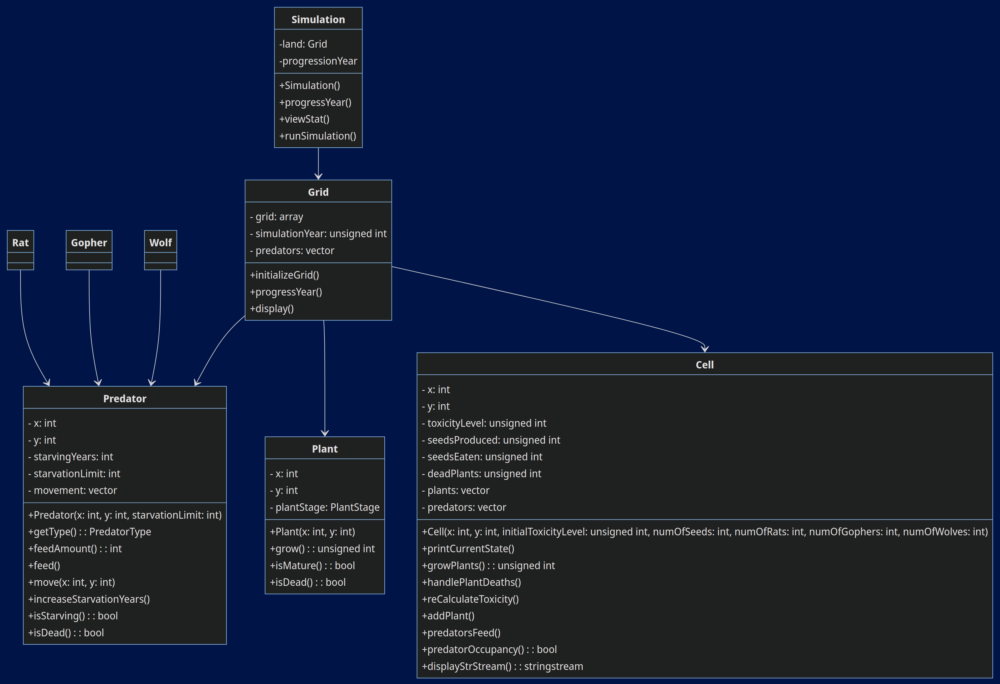

# Simulation Program README

## Overview

This repository contains the source code for a simulation program developed by Pooja Kulkarni (Student ID: 111024438). The program simulates an ecosystem with various entities such as plants and predators interacting within a grid environment.

## Program Structure

The program follows a modular structure with separate classes for Simulation, Grid, Cell, Plant, and Predator. Each class encapsulates specific functionalities related to the simulation process and entity behaviors.

## UML Class Diagram



## Program Status

The program has been fully implemented, but there are some debug errors that need to be addressed. The functionality is mostly complete, but there may be issues with certain features or unexpected behavior.

## Tested Platforms

- Visual Studio Code with GitHub Codespaces


## Compilation Instructions

To compile the program, use the following command:

```bash
g++ Cell.cpp Gopher.cpp Grid.cpp main.cpp Plant.cpp Rat.cpp Simulation.cpp Wolf.cpp -o simulation

```

Run

```bash
./a.out
```